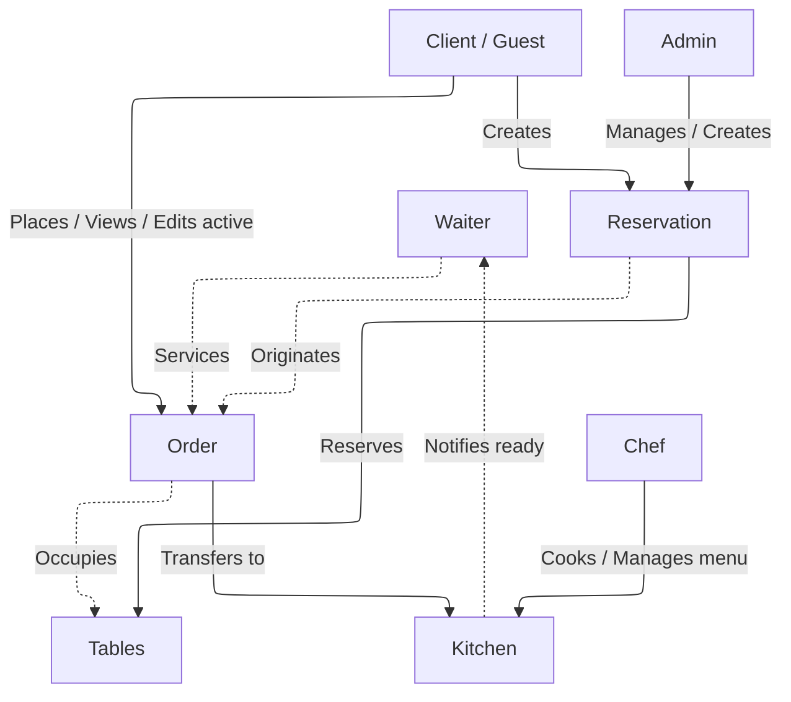

# Specification 

Застосунок для управління посадкою гостей у ресторанах і великих закладах громадського харчування, що працює як за попереднім бронюванням, так і в порядку живої черги. Допомагає оптимізувати процес оформлення замовлень та їх миттєвої передачі на кухню

### Сценарії використання

#### Сценарій 1 (Обслуговування в закладі)

1. **Посадка та бронювання столів**:
   - *За попереднім бронюванням*: адміністратор резервує стіл для клієнта (опціонально: додає попереднє замовлення) або клієнт бронює стіл самостійно через застосунок
   - *У порядку живої черги*: Адміністратор перевіряє наявність вільних столів у системі та здійснює посадку, роблячи бронування в реальному часі
2. **Оформлення, перегляд та редагування замовлення клієнтом**:
   - Клієнт самостійно обирає позиції з меню та формує замовлення
   - Клієнт має можливість у реальному часі переглядати деталі та склад замовлення, відстежувати його статус та бачити актуальну проміжну вартість чека
   - Клієнт має змогу самостійно редагувати замовлення (додавати нові страви, змінювати кількість або видаляти позиції) доти, доки замовлення не передано в процес приготування на кухні
3. **Автоматична передача замовлення та приготування на кухні**:
   - Після підтвердження клієнтом замовлення миттєво та автоматично надходить на кухню
   - Після зміни замовлення в статус приготування, блокується можливість самостійного редагування клієнтом 
   - Готові страви шеф переводить у статус `COOKING`, що автоматично генерує сповіщення для залу
4. **Обслуговування та подача**:
   - Офіціант, закріплений за відповідним замовленням і столом, отримує сповіщення про готовність страв та виносить їх до столу клієнта

#### Сценарій 2 (Замовлення з собою / Гостьовий режим)
1. Клієнт (гість) замовляє з собою, не бронює стіл і не реєструється в базі користувачів

#### Додатково:

-> Було ухвалено рішення зберігати дані всіх зареєстрованих користувачів у таблиці USERS, а потім призначати їм ролі (клієнт, адміністратор, офіціант, кухар):

- **Клієнт**: має право самостійно створити бронювання, зробити замовлення та відстежувати проміжну вартість чека в реальному часі
- **Адміністратор**: бронює стіл для клієнта та керує посадкою (включно з прийомом гостей у порядку живої черги)
- **Офіціант**: закріплюється за замовленнями, приймає та обслуговує замовлення клієнта
- **Кухар**: миттєво отримує замовлення, змінює меню та вказує, оновлює меню і стоп-лист
- **Гість (гостьовий режим)**: незареєстрований клієнт (відсутній у базі даних), який здійснює замовлення з собою

### Деталі реалізації та сутності

- **USERS** 
    * зберігаються всі дані зареєстрованих користувачів
    * кожному призначається своя роль (за потреби може бути кілька ролей)

- **RESERVATION** 
    * за попереднім записом (з фіксацією часового проміжку)
    * посадка та бронювання може відбуватися на місці в порядку живої черги за наявності вільних столів у закладі
    * може включати не більше 3 столів в одному бронюванні
    * може оформлюватися як клієнтом, так і адміністратором

- **ORDER** 
    * прив'язується до зареєстрованого клієнта або позначається як замовлення від гостя `client_id = NULL`
    * включає всі замовлені позиції зі збереженням знімка вартості на момент замовлення
    * зберігає проміжну вартість чека
    * має закріпленого за собою офіціанта (тільки якщо замовлення обслуговується в закладі)
    * має тип замовлення та статуси виконання

- **TABLE** 
    * місце для посадки клієнтів (в обмеженій кількості)
    * має прив'язку до замовлення або бронювання
    * може мати статуси (вільний | зайнятий | заброньований) для контролю посадки в залі
    * може бути прив'язаний лише до одного активного замовлення одночасно

- **MENU_ITEM** 
    * включає перелік усіх позицій меню, їх вартість, час приготування та доступність
    * керується кухарем/шефом; недоступні страви автоматично зникають або блокуються для вибору в залі

### Бізнес-правила

- Клієнт може бронювати стіл заздалегідь, сісти за вільний стіл на місці (жива черга) або замовити з собою
- Один стіл може мати лише одне активне бронювання або замовлення в конкретний момент часу
- В одному бронюванні може бути заброньовано відразу кілька столів (наприклад, для великої компанії), але не більше 3
- Замовлення має містити щонайменше одну позицію з меню
- Клієнт має змогу замовити кілька однакових позицій з меню
- Клієнт має можливість у реальному часі переглядати склад свого замовлення, його поточний статус та актуальну проміжну вартість чека
- Клієнт має право самостійно редагувати позиції замовлення (додавати, змінювати кількість або видаляти страви) лише до моменту, поки воно перебуває в статусі `ACTIVE`
- Проміжна вартість замовлення автоматично перераховується системою в реальному часі при будь-якій зміні позицій
- Завершення приготування автоматично генерує сповіщення закріпленому офіціанту для оперативної подачі до столу
- Можливо замовити їжу з собою та не реєструватися в системі (гостьовий режим)

### Діаграма взаємодії

