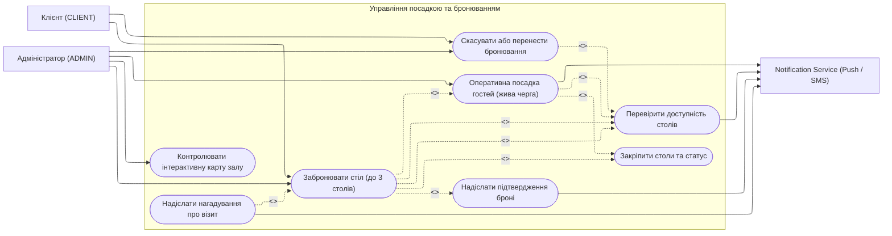

```mermaid 
---
config:
    layout: elk
---
flowchart LR
    Client["Client"]
    Admin["Admin"]
    Client["Клієнт (CLIENT)"]
    Admin["Адміністратор (ADMIN)"]
    NotifyService["Notification Service (Push / SMS)"]

    subgraph System ["Управління посадкою та бронюванням"]
      UC1(["Создавать бронь"])
      UC2(["Просматривать статусы и количество свободных столов в текущем времени"])
      UC3(["Отменить / перенести бронь"])
      UC4(["Уведомление об успешном бронировании"])
      UC5(["Напоминание о бронировании"])
      UC1(["Забронювати стіл (до 3 столів)"])
      UC2(["Контролювати інтерактивну карту залу"])
      UC3(["Скасувати або перенести бронювання"])
      UC4(["Оперативна посадка гостей (жива черга)"])
      UC5(["Перевірити доступність столів"])
      UC6(["Закріпити столи та статус"])
      UC7(["Надіслати підтвердження броні"])
      UC8(["Надіслати нагадування про візит"])
    end

    Client --> UC1
    Client --> UC3

    Admin --> UC1
    Admin --> UC2
    Admin --> UC3
    Admin --> UC4

    UC1 -.->|<<include>>| UC4
    UC1 -.->|<<extend>>| UC5
    UC1 -.->|"<<include>>"| UC5
    UC1 -.->|"<<include>>"| UC6
    UC1 -.->|"<<include>>"| UC7

    UC4 --> NotifyService
    UC5 --> NotifyService
    UC4 -.->|"<<include>>"| UC5
    UC4 -.->|"<<include>>"| UC6

    UC3 -.->|"<<include>>"| UC5

    UC8 -.->|"<<extend>>"| UC1

    UC7 --> NotifyService
    UC8 --> NotifyService
```