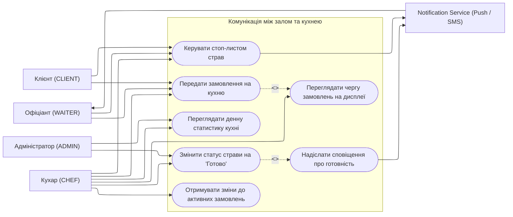

```mermaid
---
config:
    layout: elk
---
flowchart LR
    Client["Client"]
    Waiter["Waiter"]
    Admin["Admin"]
    Chef["Chef"]
    Client["Клієнт (CLIENT)"]
    Waiter["Офіціант (WAITER)"]
    Chef["Кухар (CHEF)"]
    Admin["Адміністратор (ADMIN)"]
    NotifyService["Notification Service (Push / SMS)"]

    subgraph System ["Комунікація між залом та кухнею"]
      UC1(["Бачити чергу замовлень"])
      UC2(["Сповіщення про зміни"])
      UC3(["Додавати страви до стоп-листа"])
      UC4(["Сповіщення, страва у статусi «Готово»"])
      UC5(["Перегляд статистики"])
      UC1(["Передати замовлення на кухню"])
      UC2(["Переглядати чергу замовлень на дисплеї"])
      UC3(["Отримувати зміни до активних замовлень"])
      UC4(["Керувати стоп-листом страв"])
      UC5(["Змінити статус страви на 'Готово'"])
      UC6(["Надіслати сповіщення про готовність"])
      UC7(["Переглядати денну статистику кухні"])
    end

    Chef --> UC1
    Client --> UC1
    Waiter --> UC1

    Chef --> UC2
    Chef --> UC3
    Chef --> UC4
    Chef --> UC5
    Chef --> UC7

    Client --> UC4
    Admin --> UC7

    Waiter --> UC4
    UC1 -.->|"<<include>>"| UC2
    UC5 -.->|"<<include>>"| UC6

    Admin --> UC5

    UC4 --> NotifyService
    UC6 --> NotifyService
    NotifyService --> Waiter
```