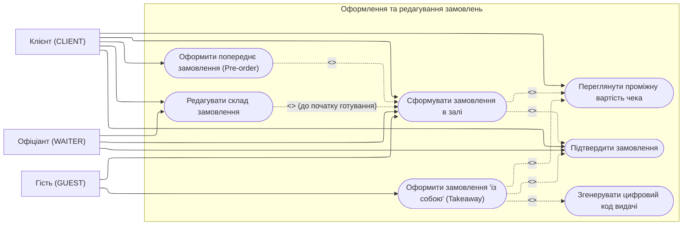

```mermaid 
---
config:
    layout: elk
---
flowchart LR
    Client["Client"]
    Waiter["Waiter"]
    Guest["Guest"]
    Client["Клієнт (CLIENT)"]
    Waiter["Офіціант (WAITER)"]
    Guest["Гість (GUEST)"]

    subgraph System ["Оформлення та редагування замовлень"]
      UC1(["Оформлення замовлення"])
      UC2(["Перегляд проміжної ціни"])
      UC1(["Сформувати замовлення в залі"])
      UC2(["Переглянути проміжну вартість чека"])
      UC3(["Редагувати склад замовлення"])
      UC4(["Pre-order"])
      UC5(["Оформлення замовлення 'із собою'"])
      UC6(["Підтверджувати замовлення"])
      UC4(["Оформити попереднє замовлення (Pre-order)"])
      UC5(["Оформити замовлення 'із собою' (Takeaway)"])
      UC6(["Підтвердити замовлення"])
      UC7(["Згенерувати цифровий код видачі"])
    end

    Client --> UC1
    Client --> UC2
    Client --> UC3
    Client --> UC4
    Client --> UC6

    Waiter --> UC1
    Waiter --> UC3
    Waiter --> UC6
    
    Guest --> UC1

    Guest --> UC5

    UC1 -.->|"<<include>>"| UC2
    UC1 -.->|"<<include>>"| UC6

    UC5 -.->|"<<include>>"| UC2
    UC5 -.->|"<<include>>"| UC6
    UC5 -.->|"<<include>>"| UC7

    UC4 -.->|"<<extend>>"| UC1
    UC3 -.->|"<<extend>> (до початку готування)"| UC1
```