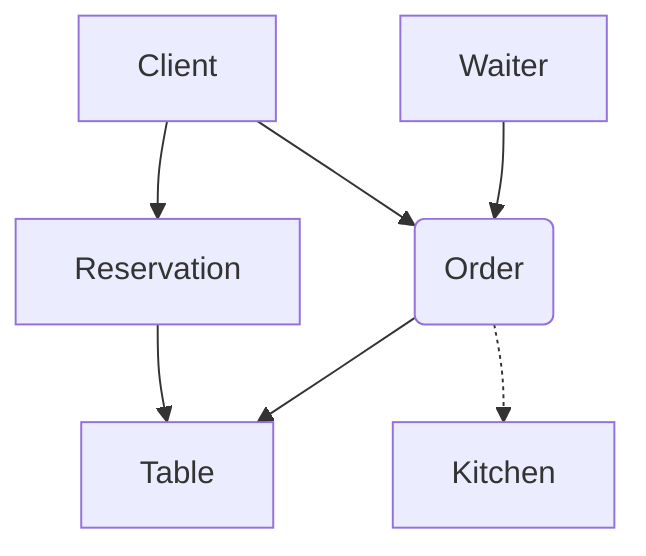

# TableFlow

### Опис

Застосунок для управління посадкою гостей у ресторанах і великих закладах громадського харчування, що працює як за попереднім бронюванням, так і в порядку живої черги. Головна мета — оптимізувати процес оформлення замовлень та їх миттєвої передачі на кухню.

Функції:

- Ефективне управління посадкою та резервуванням столів

- Надання клієнтам можливості самостійно переглядати й редагувати замовлення, а також відстежувати його поточну вартість

- Покращення комунікації та автоматизація обміну даними між гостьовим залом і кухнею

### Mermaid  

### Посилання

- [DB_Model](model.md)
- [Defense](DEFENSE.md)
- [Specification](spec.md)