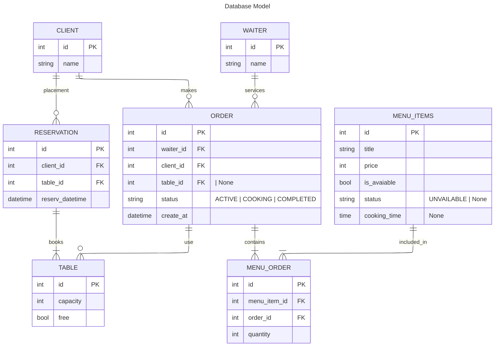
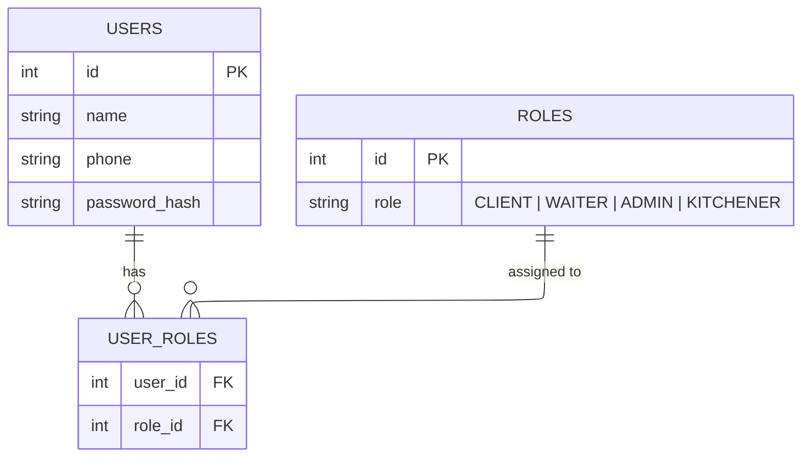

# TableFlow Model

### Basic scheme

```mermaid
---
title: Database Model
config:
    layout: elk
---
erDiagram
    CLIENT ||--o{ RESERVATION: "placement"
    CLIENT ||--o{ ORDER : "makes"
    

    WAITER ||--o{ ORDER: "services"
    ORDER ||--o{ TABLE: "use"

    RESERVATION ||--|{ TABLE: "books"

    ORDER ||--|{ MENU_ORDER: "contains"
    MENU_ITEMS ||--|{ MENU_ORDER: "included_in"

    CLIENT {
        int id PK
        string name
    }

    ORDER {
        int id PK
        int waiter_id FK
        int client_id FK 
        int table_id FK "| None"
        string status "ACTIVE | COOKING | COMPLETED"
        datetime create_at 
    }

    TABLE {
        int id PK 
        int capacity
        bool free
    }

    WAITER {
        int id PK
        string name
    }

    RESERVATION {
        int id PK
        int client_id FK
        int table_id FK
        datetime reserv_datetime
    }

    MENU_ITEMS {
        int id PK
        string title 
        int price 
        bool is_avaiable
        string status "UNVAILABLE | None"
        time cooking_time "None"
    }

    MENU_ORDER {
        int id PK
        int menu_item_id FK
        int order_id FK
        int quantity
    }
```

### USER_ROLE Model

```mermaid
---
config:
    layout: elk
---
erDiagram
    USERS ||--o{ USER_ROLES : "has"
    ROLES ||--o{ USER_ROLES : "assigned to"

    USERS {
        int id PK
        string name
        string phone
        string password_hash
    }

    ROLES {
        int id PK
        string role "CLIENT | WAITER | ADMIN | KITCHENER"
    }

    USER_ROLES {
        int user_id FK
        int role_id FK
    }
```