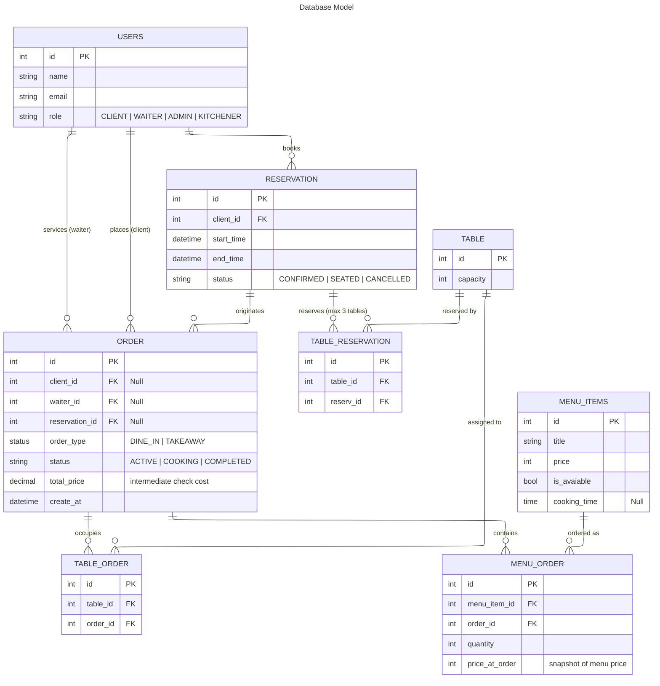
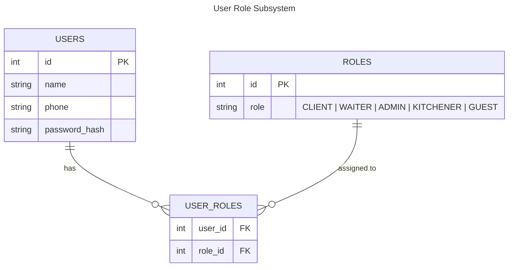

# TableFlow Model

```mermaid
---
title: Database Model
config:
    layout: elk
---
erDiagram
    USERS ||--o{ RESERVATION: "books"
    USERS ||--o{ ORDER : "places (client)"
    

    USERS ||--o{ ORDER: "services (waiter)"
    ORDER ||--o{ TABLE_ORDER: "occupies"
    TABLE ||--o{ TABLE_ORDER: "assigned to"

    RESERVATION ||--o{ TABLE_RESERVATION: "reserves (max 3 tables)"
    RESERVATION ||--o{ ORDER: "originates"
    TABLE ||--o{ TABLE_RESERVATION: "reserved by"

    ORDER ||--o{ MENU_ORDER: "contains"
    MENU_ITEMS ||--o{ MENU_ORDER: "ordered as"

    USERS {
        int id PK
        string name
        string email
        string role "CLIENT | WAITER | ADMIN | KITCHENER"
    }

    ORDER {
        int id PK
        int client_id FK "Null"
        int waiter_id FK "Null"
        int reservation_id FK "Null"
        status order_type "DINE_IN | TAKEAWAY"
        string status "ACTIVE | COOKING | COMPLETED"
        decimal total_price "intermediate check cost"
        datetime create_at 
    }

    TABLE {
        int id PK 
        int capacity
    }

    TABLE_ORDER {
        int id PK
        int table_id FK 
        int order_id FK
    }

    RESERVATION {
        int id PK
        int client_id FK
        datetime start_time
        datetime end_time
        string status "CONFIRMED | SEATED | CANCELLED"
    }

    TABLE_RESERVATION {
        int id PK
        int table_id FK 
        int reserv_id FK
    }

    MENU_ITEMS {
        int id PK
        string title 
        int price 
        bool is_avaiable
        time cooking_time "Null"
    }

    MENU_ORDER {
        int id PK
        int menu_item_id FK
        int order_id FK
        int quantity
        int price_at_order "snapshot of menu price"
    }
```

---

```mermaid
---
title: User Role Subsystem
---
erDiagram
    USERS ||--o{ USER_ROLES: "has"
    ROLES ||--o{ USER_ROLES: "assigned to"

    USERS {
        int id PK
        string name
        string phone
        string password_hash
    }

    ROLES {
        int id PK
        string role "CLIENT | WAITER | ADMIN | KITCHENER | GUEST"
    }

    USER_ROLES {
        int user_id FK
        int role_id FK
    }
```