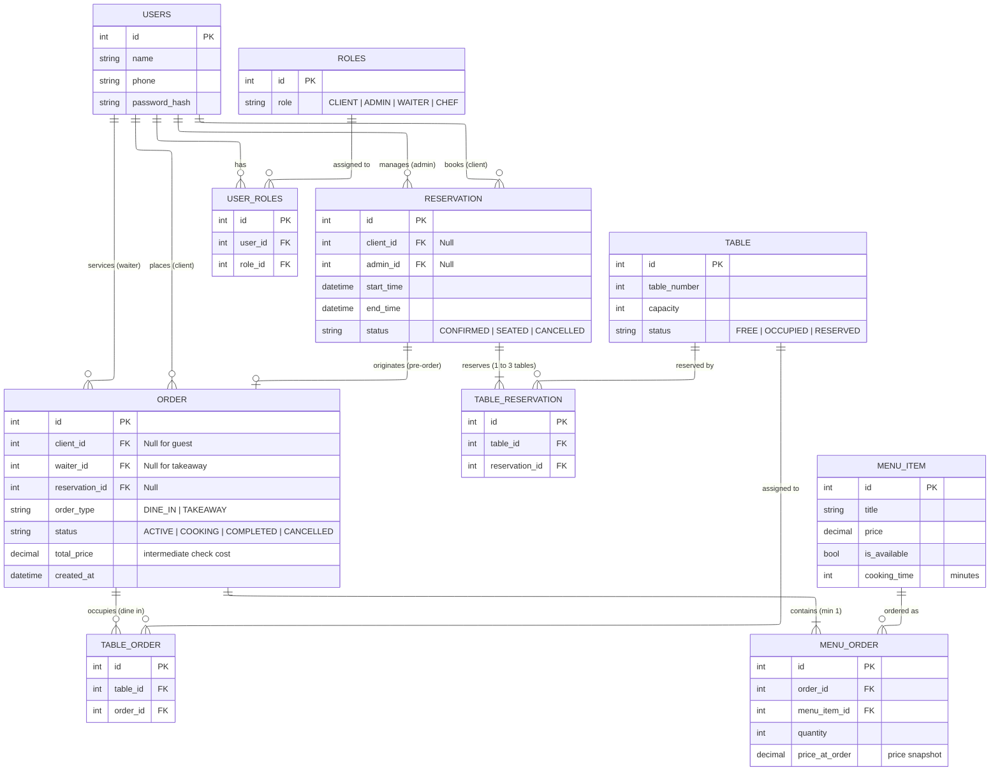
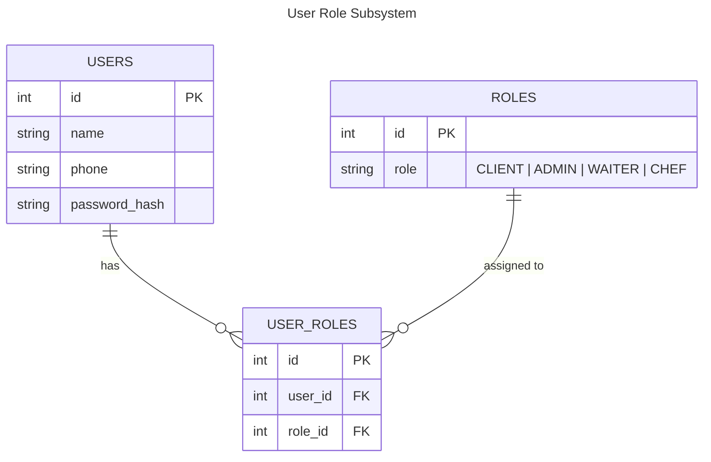

# TableFlow Model

### Database Model

```mermaid
---
config:
    layout: elk
---
erDiagram
    USERS ||--o{ USER_ROLES : "has"
    ROLES ||--o{ USER_ROLES : "assigned to"

    USERS ||--o{ RESERVATION : "books (client)"
    USERS ||--o{ RESERVATION : "manages (admin)"
    USERS ||--o{ ORDER : "places (client)"
    USERS ||--o{ ORDER : "services (waiter)"

    RESERVATION ||--|{ TABLE_RESERVATION : "reserves (1 to 3 tables)"
    TABLE ||--o{ TABLE_RESERVATION : "reserved by"
    RESERVATION ||--o| ORDER : "originates (pre-order)"

    ORDER ||--o{ TABLE_ORDER : "occupies (dine in)"
    TABLE ||--o{ TABLE_ORDER : "assigned to"

    ORDER ||--|{ MENU_ORDER : "contains (min 1)"
    MENU_ITEM ||--o{ MENU_ORDER : "ordered as"

    USERS {
        int id PK
        string name
        string phone
        string password_hash
    }

    ROLES {
        int id PK
        string role "CLIENT | ADMIN | WAITER | CHEF"
    }

    USER_ROLES {
        int id PK
        int user_id FK
        int role_id FK
    }

    TABLE {
        int id PK
        int table_number
        int capacity
        string status "FREE | OCCUPIED | RESERVED"
    }

    RESERVATION {
        int id PK
        int client_id FK "Null"
        int admin_id FK "Null"
        datetime start_time
        datetime end_time
        string status "CONFIRMED | SEATED | CANCELLED"
    }

    TABLE_RESERVATION {
        int id PK
        int table_id FK
        int reservation_id FK
    }

    ORDER {
        int id PK
        int client_id FK "Null for guest"
        int waiter_id FK "Null for takeaway"
        int reservation_id FK "Null"
        string order_type "DINE_IN | TAKEAWAY"
        string status "ACTIVE | COOKING | COMPLETED | CANCELLED"
        decimal total_price "intermediate check cost"
        datetime created_at
    }

    TABLE_ORDER {
        int id PK
        int table_id FK
        int order_id FK
    }

    MENU_ITEM {
        int id PK
        string title
        decimal price
        bool is_available
        int cooking_time "minutes"
    }

    MENU_ORDER {
        int id PK
        int order_id FK
        int menu_item_id FK
        int quantity
        decimal price_at_order "price snapshot"
    }
```

---

### User Role Subsystem

```mermaid
---
title: User Role Subsystem
---
erDiagram
    USERS ||--o{ USER_ROLES : "has"
    ROLES ||--o{ USER_ROLES : "assigned to"

    USERS {
        int id PK
        string name
        string phone
        string password_hash
    }

    ROLES {
        int id PK
        string role "CLIENT | ADMIN | WAITER | CHEF"
    }

    USER_ROLES {
        int id PK
        int user_id FK
        int role_id FK
    }
```