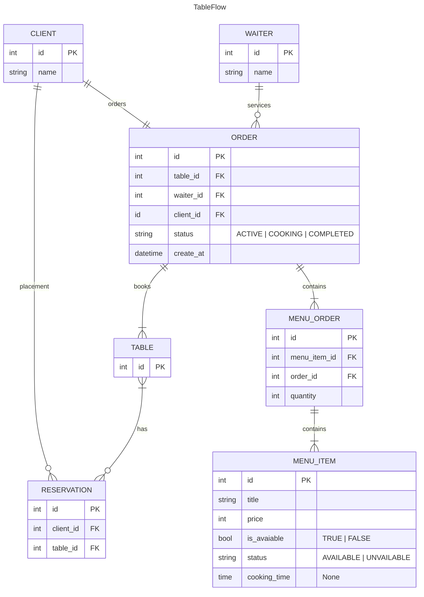

### TableFlow Model

```mermaid
---
title: TableFlow
---
erDiagram
    CLIENT ||--o{ RESERVATION: "placement"
    CLIENT ||--|| ORDER: "orders"

    WAITER ||--o{ ORDER: "services"
    ORDER ||--|{ TABLE: "books"

    TABLE }|--o{ RESERVATION: "has"

    ORDER ||--|{ MENU_ORDER: "contains"
    MENU_ORDER ||--|{ MENU_ITEM: "contains"

    ORDER {
        int id PK
        int table_id FK 
        int waiter_id FK
        id client_id FK 
        string status "ACTIVE | COOKING | COMPLETED"
        datetime create_at 
    }

    MENU_ITEM {
        int id PK
        string title 
        int price 
        bool is_avaiable "TRUE | FALSE"
        string status "AVAILABLE | UNVAILABLE"
        time cooking_time "None"
    }

    MENU_ORDER {
        int id PK
        int menu_item_id FK
        int order_id FK
        int quantity
    }

    TABLE {
        int id PK 
    }

    CLIENT {
        int id PK
        string name
    }

    WAITER {
        int id PK
        string name
    }

    RESERVATION {
        int id PK
        int client_id FK
        int table_id FK
    }
```