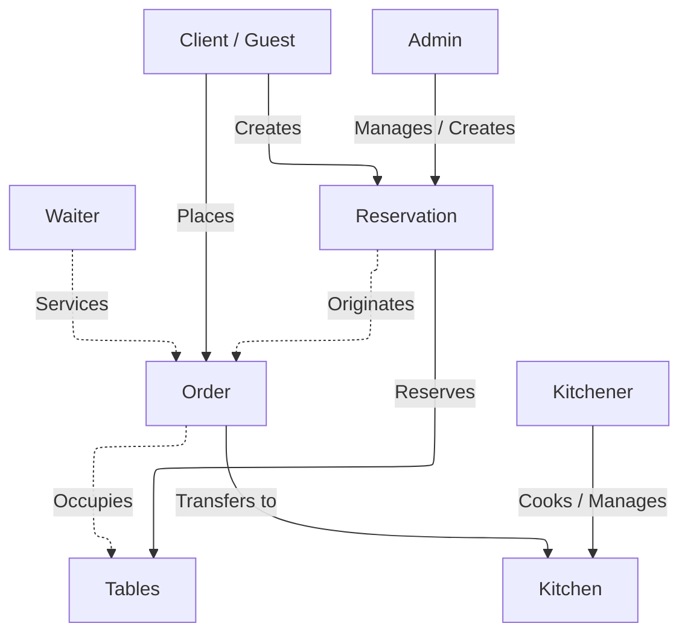

# Specification 

Застосунок для управління посадкою гостей у ресторанах і великих закладах громадського харчування, що працює як за попереднім бронюванням, так і в порядку живої черги. Допомагає оптимізувати процес оформлення замовлень та їх миттєвої передачі на кухню.

### Сценарії використання

#### Сценарій 1 (Обслуговування в закладі)
1. Адміністратор бронює стіл для клієнта (опціонально: додає попереднє замовлення) або клієнт бронює самостійно
2. Клієнт обирає позиції з меню та оформляє замовлення
3. Ресторан (кухня) отримує, обробляє запит та готує відповідні позиції
4. Офіціант, закріплений за замовленням, виносить усі страви до відповідного столу

#### Сценарій 2 (Замовлення з собою / Гостьовий режим)
1. Клієнт (гість) замовляє з собою, не бронює стіл і не реєструється в базі користувачів

#### Додатково:

-> Було ухвалено рішення зберігати дані всіх зареєстрованих користувачів у таблиці USERS, а потім призначати їм ролі (клієнт, адміністратор, офіціант, кухар):

- **Клієнт**: має право самостійно створити бронювання та зробити замовлення
- **Адміністратор**: бронює стіл для клієнта та керує посадкою
- **Офіціант**: приймає та обслуговує замовлення клієнта
- **Кухар**: змінює меню та вказує, які позиції недоступні
- **Гість (гостьовий режим)**: незареєстрований клієнт (відсутній у базі даних), який здійснює замовлення з собою

### Деталі реалізації та сутності

- **USERS** 
    * зберігаються всі дані користувача 
    * кожному призначається своя роль (за потреби може бути кілька ролей)

- **RESERVATION** 
    * за попереднім записом
    * бронювання може відбуватися без попереднього запису, якщо є вільні місця (вказує, чи є вільні столи у закладі)
    * може включати не більше 3 столів в одному бронюванні

- **ORDER** 
    * прив'язується до клієнта (або вказується як замовлення від гостя)
    * включає всі замовлені позиції 
    * зберігає проміжну вартість чека 
    * має закріпленого за собою офіціанта (тільки якщо замовлення в закладі)

- **TABLE** 
    * місце для посадки клієнтів (в обмеженій кількості)
    * має прив'язку до замовлення або бронювання
    * може мати статуси (вільний | зайнятий | заброньований)
    * може бути прив'язаний лише до одного активного замовлення одночасно

- **MENU_ITEM** 
    * включає перелік усіх позицій меню, їх вартість, час приготування та доступність

### Бізнес-правила

- Клієнт може бронювати стіл заздалегідь, на місці або замовити з собою
- Один стіл може мати лише одне активне бронювання або замовлення в конкретний момент часу
- В одному бронюванні може бути заброньовано відразу кілька столів (наприклад, для великої компанії), але не більше 3
- Замовлення має містити щонайменше одну позицію з меню
- Клієнт має змогу замовити кілька однакових позицій з меню
- Можливо замовити їжу з собою та не реєструватися в системі

### Діаграма взаємодії

