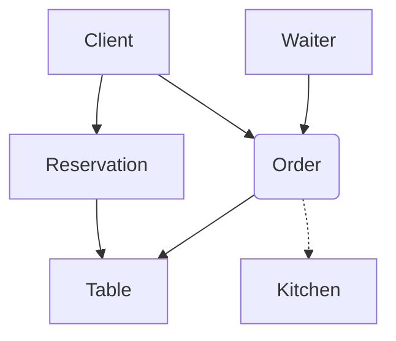

# Specification 

Застосунок для управління посадкою гостей у ресторанах і великих закладах громадського харчування, що працює як за попереднім бронюванням, так і в порядку живої черги. Головна мета — оптимізувати процес оформлення замовлень та їх миттєвої передачі на кухню.

### Сценарії використання

0. Адміністратор резервує стіл клієнту (опціонально: додає попереднє замовлення)
1. Клієнт вибирає позиції з меню та оформляє замовлення
2. Ресторан отримує, обробляє запит та готує відповідні позиції
3. Офіціант, що прикріплений до замовлення, виносить всі страви до прикріпленого столу

### Деталі реалізації

Сутності: 

- CLIENT
    * бронює/займає стіл 
    * має замовлення

- WAITER 
    * до кожного замовлення прикріплений лише один офіціант

- RESERVATION 
    * попередній запис

- ORDER 
    * прив'язується до клієнта 
    * включає всі замовлені позиції 
    * зберігає проміжну вартість чека 
    * має прикріпленого до себе офіціанта

- TABLE 
    * місце для посадки клієнтів (в обмеженій кількості)
    * має прив'язку до замовлення 
    * може мати статуси (вільний | зайнятий | заброньований)

- MENU 
    * має безліч різних позицій

- MENU_ITEM 
    * має назву, вартість, опис
    * має статус доступності

### Бізнес-правила

- Один клієнт може мати тільки одне замовлення та бронь, або ж не бронювати зовсім
- Один стіл може мати лише одну активну бронь або замовлення в конкретний момент часу
- В одній броні можуть бути заброньовані відразу кілька столів (наприклад для великої компанії), але не більше 3х
- Замовлення має містити щонайменше одну позицію з меню
- Клієнт має змогу замовити кілька однакових позицій з меню

---

